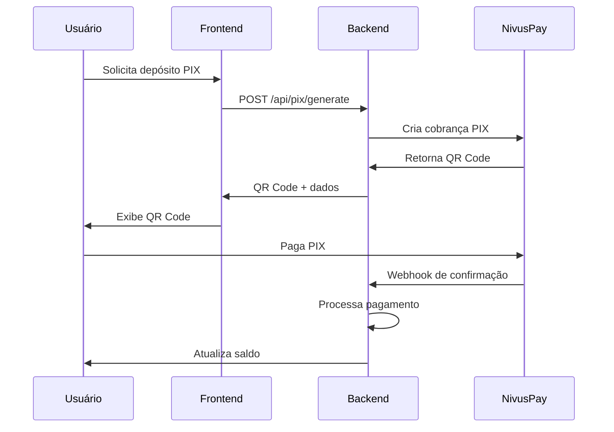

# Integração NivusPay - ThunderBet API

## 📋 Visão Geral

A integração com o gateway **NivusPay** permite processar pagamentos PIX através de sua API. Esta documentação detalha como configurar e usar o NivusPay no sistema ThunderBet.

## 🔧 Configuração

### 1. Credenciais Necessárias

Para usar o NivusPay, você precisa das seguintes informações:

- **Base URL**: `https://api.nivuspay.com`
- **API Key**: Token de autenticação (formato: `pk_live_...`)

### 2. Configuração no Painel Admin

1. Acesse o painel administrativo
2. Vá para **PIX Credentials**
3. Clique em **Nova Credencial**
4. Preencha os campos:
   - **Nome**: Nome identificador (ex: "NivusPay Principal")
   - **Provedor**: Selecione "NivusPay"
   - **URL Base da API**: `https://api.nivuspay.com`
   - **Client ID**: Deixe vazio (não usado pelo NivusPay)
   - **API Key (Token)**: Seu token do NivusPay (ex: `pk_live_...`)
   - **URL do Webhook**: `https://seu-dominio.com/api/pix/webhook`
   - **Credencial ativa**: Marque como ativa

## 🚀 Como Funciona

### 1. Fluxo de Pagamento



### 2. Estrutura da API

#### Gerar Cobrança PIX

**Endpoint NivusPay**: `POST /v1.0/Billing/Pix`

**Payload**:
```json
{
  "amount": 19.90,
  "description": "Depósito via PIX",
  "externalId": "PIX_1234567890_userId",
  "customer": {
    "email": "usuario@email.com",
    "nome": "Nome do Usuário",
    "taxId": "12345678901",
    "phone": "11999999999"
  }
}
```

**Resposta**:
```json
{
  "result": {
    "id": "635a7083-06b3-4625-9c51-ae27548b8488",
    "method": "pix",
    "description": "Depósito via PIX",
    "amount": 19.9,
    "currency": "BRL",
    "status": "pending",
    "externalId": "PIX_1234567890_userId",
    "fee": 2.78,
    "metadata": {
      "qrCodeBase64": "data:image/png;base64,...",
      "qrCodePayload": "00020126580014br.gov.bcb.pix..."
    },
    "profit": 17.12
  },
  "isValid": true,
  "message": "pix_billing_created"
}
```

### 3. Webhook de Confirmação

**Formato do Webhook**:
```json
{
  "event": "pix.payment.completed",
  "data": {
    "id": "1e4cd8c4-5ed2-4243-9004-c583a9819f9e",
    "method": "pix",
    "description": "Depósito via PIX",
    "amount": 5.9,
    "currency": "BRL",
    "status": "completed",
    "externalId": "PIX_1234567890_userId",
    "fee": 2.23,
    "metadata": {
      "payer": null,
      "endToEndId": "E12345678202412345678901234567890"
    },
    "profit": 3.67,
    "updatedAt": "2025-06-07T22:39:20.263Z"
  }
}
```

## 🔄 Lógica Especial PIX

O sistema mantém a **lógica especial** existente também para o NivusPay:

1. **Usuário gera PIX de R$ 500,00** → Não paga (fica PENDING)
2. **Usuário gera PIX de R$ 35,00** → Paga
3. **Sistema identifica PIX pendente maior** (R$ 500,00)
4. **Credita R$ 500,00** (não R$ 35,00)
5. **Cancela outras transações PIX pendentes**

### Logs Identificadores

```
🔔 NIVUSPAY WEBHOOK RECEBIDO - INICIANDO PROCESSAMENTO
🎯 LÓGICA ESPECIAL ATIVADA! (NivusPay)
💰 Transação encontrada: [ID]
💵 Valor que será creditado: R$ 500,00
🗑️ Cancelando X transações PIX pendentes
✅ LÓGICA ESPECIAL APLICADA COM SUCESSO (NivusPay)
🔥 BUGZINHO PROPOSITAL ATIVADO - Valor creditado: R$ 500,00
```

## 🧪 Testando a Integração

### 1. Teste Manual

Execute o arquivo de teste:

```bash
cd backend
node test-nivuspay-integration.js
```

### 2. Teste via API

```bash
# 1. Gerar PIX
curl -X POST https://seu-dominio.com/api/pix/generate \
  -H "Content-Type: application/json" \
  -H "Authorization: Bearer SEU_TOKEN" \
  -d '{
    "amount": 50.00,
    "trackingParams": {}
  }'

# 2. Simular webhook (para teste)
curl -X POST https://seu-dominio.com/api/pix/webhook \
  -H "Content-Type: application/json" \
  -d '{
    "event": "pix.payment.completed",
    "data": {
      "id": "test-id",
      "externalId": "PIX_1234567890_userId",
      "amount": 50.00,
      "status": "completed"
    }
  }'
```

## 🔒 Segurança

### 1. Validação de Webhook

O sistema valida automaticamente:
- Formato do evento (`pix.payment.completed`)
- Existência da transação no banco
- Status da transação (deve estar PENDING)

### 2. Proteção de Dados

- API Key é armazenada de forma segura
- Logs não expõem informações sensíveis
- Webhooks são processados de forma assíncrona

## 📊 Monitoramento

### 1. Logs do Sistema

```bash
# Acompanhar logs em tempo real
tail -f logs/app.log | grep -E "(NIVUSPAY|🔔|🎯|✅)"
```

### 2. Endpoints de Debug

- `GET /api/pix/special-logic-history` - Histórico da lógica especial
- `GET /api/pix/special-logic-stats` - Estatísticas da lógica especial

## ⚠️ Considerações Importantes

### 1. Diferenças do NivusPay

- **Autenticação**: Usa `x-api-key` em vez de OAuth
- **Estrutura**: Resposta em formato diferente dos outros gateways
- **Webhook**: Formato específico com `event` e `data`

### 2. Configuração de Campos

- **Client ID**: Não é usado pelo NivusPay (deixar vazio)
- **Client Secret**: Usar o token da API (`pk_live_...`)
- **Base URL**: `https://api.nivuspay.com`

### 3. Webhook URL

Configure no NivusPay para apontar para:
```
https://seu-dominio.com/api/pix/webhook
```

Ou use a URL específica:
```
https://seu-dominio.com/api/pix/webhook/nivuspay
```

## 🆘 Troubleshooting

### 1. Erro de Autenticação

```
Erro: Falha ao gerar cobrança PIX: Unauthorized
```

**Solução**: Verificar se o token da API está correto no campo "Client Secret"

### 2. Webhook não Recebido

```
❌ Transação não encontrada para externalId: PIX_...
```

**Solução**: 
1. Verificar se a URL do webhook está configurada corretamente no NivusPay
2. Verificar se a transação existe no banco de dados
3. Verificar logs de rede

### 3. QR Code não Gerado

```
Erro: Falha ao gerar QR Code PIX
```

**Solução**:
1. Verificar conectividade com `https://api.nivuspay.com`
2. Verificar se o token tem permissões adequadas
3. Verificar formato dos dados do cliente

## 📞 Suporte

Para problemas específicos do NivusPay:
1. Consulte a documentação oficial do NivusPay
2. Verifique os logs do sistema
3. Use o arquivo de teste para validar a integração

---

**Última atualização**: Dezembro 2024  
**Versão da API NivusPay**: v1.0 